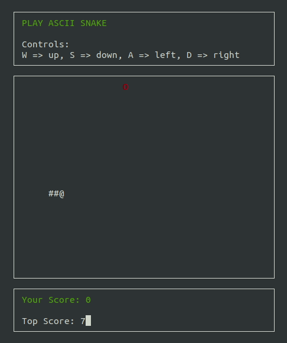

# Cpp-ND-capestone_snake_game

Capestone project for udacity nano-degree program. Ascii Snake game using ncurses as the renderer.   
All class files (headers and definations) are located in the `src` folder. The main function is to be found in
file `Snake.cpp`. Idea inspired by youtuber **casual coder**.

* As with traditional snake game functionality, the game involves a snake the moves in the direction of the player's
  choice.
* The snake consumes apples on the board and grows in size. The game ends if the snake bites its own body.
* The player gains a point everytime they consume an apple.

## Dependencies for Running Locally

* cmake >= 3.7
    * All OSes: [click here for installation instructions](https://cmake.org/install/)
* make >= 4.1 (Linux, Mac), 3.81 (Windows)
    * Linux: make is installed by default on most Linux distros
    * Mac: [install Xcode command line tools to get make](https://developer.apple.com/xcode/features/)
    * Windows: [Click here for installation instructions](http://gnuwin32.sourceforge.net/packages/make.htm)
* ncurses
    * [ncurses](https://www.gnu.org/software/ncurses/) is a library that facilitates text-based graphical output in the
      terminal.
    * This project relies on ncurses for display output.

## Basic Build Instructions

1. Clone this repo.
2. Make a build directory in the top level directory: `mkdir build && cd build`
3. Compile: `cmake .. && make`
4. Run it: `./snake`.

## Rubric Points Covered

### Loops, Functions, I/O
1. The project demonstrates an understanding of C++ functions and control structures. 
  - Please refer to src folder for all class declarations and definitions
2. The project reads data from a file and process the data, or the program writes data to a file. 
  - Program uses a file to store top score and retrieves the top score from the file on start. `Game.cpp - ln 181 - 204`
3. The project accepts user input and processes the input.
  - Program uses keys `w`, `d`, `s`, `a` as direction keys for the snake. `Game.cpp - ln 82`

### Object Oriented Programming
1. The project uses Object Oriented Programming techniques.
  - Please refer to `src` folder
2. Classes use appropriate access specifiers for class members.
  - Please refer to `src` folder
3. Class constructors utilize member initialization lists.
  - Please refer to `Game.cpp -ln 14, and any other chosen class.` . I used initializer lists across the project where acceptable.
4. Classes abstract implementation details from their interfaces.
  - Implemented in all classes and also correctly worded the class names and put doc-strings where extra explanation is necessary.
5. Classes encapsulate behavior.
  - Applied across project
6. Classes follow an appropriate inheritance hierarchy.
  - Inheritance applied in the instance of `Player` in relation to `Drawable`. 
7. Overloaded functions allow the same function to operate on different parameters.
  - Not actively used except for constructor definitions on `Game.cpp`
8. Derived class functions override virtual base class functions.
  - Please refer to `Game.cpp - ln 147`
9. Templates generalize functions in the project.
  - Not actively used in project.

### Memory Management
1. The project makes use of references in function declarations.
  - Please refer to `Player.cpp - ln 97`
2. The project uses destructors appropriately.
  - Used in the case of Game class to destroy a pointer to the apple object. Please refer `Game.cpp - ln 19`
3. The project uses scope / Resource Acquisition Is Initialization (RAII) where appropriate.
  - Implemented
4. The project follows the Rule of 5.
  - Please refer to `Game.cpp` and `Game.h`
5. The project uses move semantics to move data, instead of copying it, where possible.
  - Used throughout project - refer to `Snake.cpp - ln 9`
6. The project uses smart pointers instead of raw pointers.
  - Implemented, refer to `Snake.cpp`

### Concurrency
1. The project uses multithreading.
  - Implemented to avoid blocking operation when waiting for user input - Refer to `Snake.cpp - ln 25`
2. A promise and future is used in the project.
  - Not actively used.
3. A mutex or lock is used in the project.
  - Used to avoid race condition when accessing direction variable used on snake movement which is also updated when user provides input - `Game.cpp - ln 84`
4. A condition variable is used in the project.
  - Not actively used in project.
