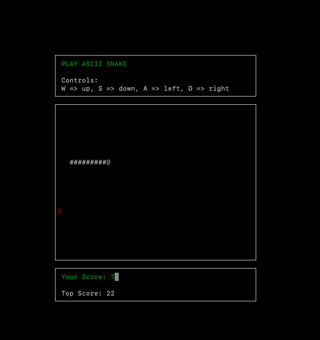

# Cpp-ND-capestone_snake_game
Capestone project for udacity nano-degree program. Ascii Snake game using ncurses as the renderer.  
All class files (headers and definations) are located in the `src` folder. The main function is to be found 
in file `Snake.cpp`.

* As with traditional snake game functionality, the game involves a snake the moves in the direction of the player's 
choice.
* The snake consumes apples on the board and grows in size. The game ends if the snake bites its own body. 
* The player gains a point everytime they consume an apple.

## Dependencies for Running Locally
* cmake >= 3.7
    * All OSes: [click here for installation instructions](https://cmake.org/install/)
* make >= 4.1 (Linux, Mac), 3.81 (Windows)
    * Linux: make is installed by default on most Linux distros
    * Mac: [install Xcode command line tools to get make](https://developer.apple.com/xcode/features/)
    * Windows: [Click here for installation instructions](http://gnuwin32.sourceforge.net/packages/make.htm)
* ncurses   
    * [ncurses](https://www.gnu.org/software/ncurses/) is a library that facilitates text-based graphical output in the terminal.
    * This project relies on ncurses for display output.
    

## Basic Build Instructions

1. Clone this repo.
2. Make a build directory in the top level directory: `mkdir build && cd build`
3. Compile: `cmake .. && make`
4. Run it: `./snake`.